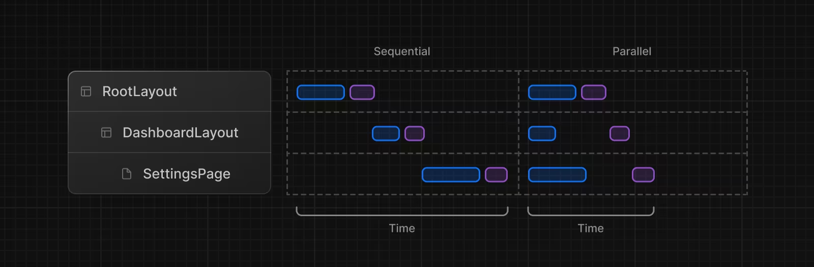

# Fetching and Caching
- Sử dụng fetch trong server component, response từ fetch sẽ tự động được cache lại. Nếu không sử dụng dynamic data trong
router(có các params thay đổi), nó sẽ được build thành 1 statis page.
- Có thể bỏ qua cơ chế cache bằng cách thêm options:
  + cache: let data = await fetch('https://api.vercel.app/blog')
  + no-cache: let data = await fetch('https://api.vercel.app/blog', { cache: 'no-store' })

# Request Memoization

- Trong nextjs việc fetch data ở global sau đó pass xuống các lớp con qua props là không
  cần thiết. Chúng ta có thể fetch ở từng lớp con mà không ảnh hưởng đến hiệu năng vì nextjs
  sẽ tự ghi nho lại request nếu nó có cùng url và cùng tham số truyền vào.

# ORMs and Database Clients

- Có thể dùng React.cache để ghi nhớ lại request. Sẽ chỉ có 1 request được gửi đến DB khi có cùng một params được truyền vào.

# Parallel and Sequential.

- Parallel: Các request phụ thuộc lẫn nhau, điều này sẽ tăng thời gian thực hiện yêu cầu
- Sequential: Các request sẽ thực hiện đồng thời.
  + Với cơ chế sử dụng asyn/await: Các yêu cầu khi đang thực hiện, các dòng yêu cầu bên dưới sẽ bị dừng lại, có thể sử dụng Promise.all để thực hiện các yêu cầu đồng thời.

